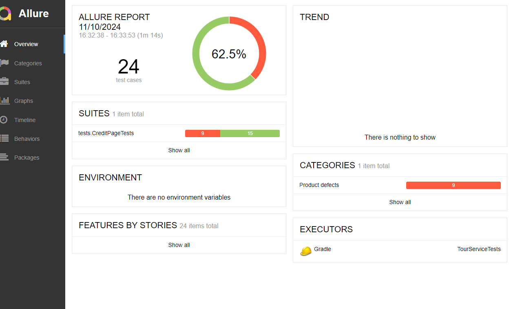
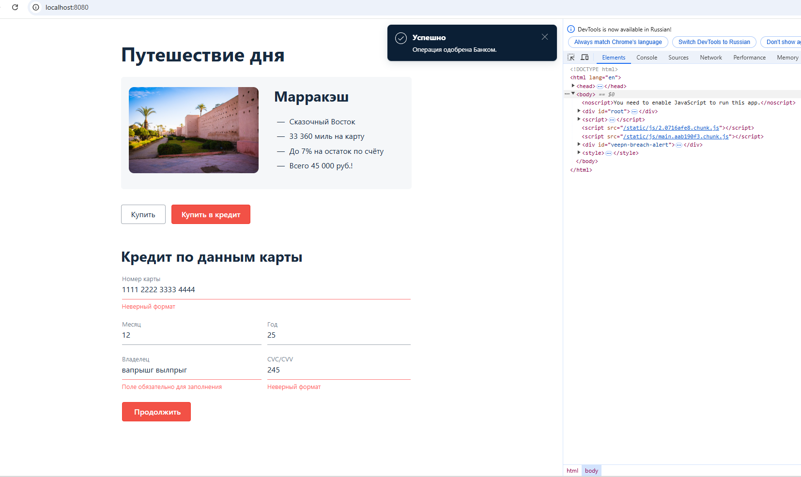

# Отчет по итогам тестирования
### Краткое описание:
В ходе работ над проектом было проведено тестирование веб-сервиса "Путешествие дня", которое представляет собой 
сервис, взаимодействующий с СУБД и API Банка.
На первом этапе было проведено исследовательское тестирование для ознакомления с проектом и написания плана
для более углубленного тестирования.
Затем были написаны автотесты и проведено автоматизированное тестирование сервиса, включающее в себя проверку 
как позитивных, так и негативных сценариев приобретения тура, тестирование UI и СУБД.
Тестирование проведено для Базы Данных MySQL.

### Количество тест-кейсов
Общее количество тест-кейсов - 24, из них 16 успешных и 8 неуспешных.
По итогам сформирован отчет с использованием AllureReportPortal

### Найденные дефекты:
- операция не отклоняется Банком при вводе валидных данных во всех полях при введении DECLINED данных карты
- можно провести оплату с несуществующей карты, несколько раз кликнув мышкой в любом пустом месте формы;
- в поле "Месяц" можно ввести два ноля и операция пройдет успешно;
- можно совершить покупку, введя только имя или только фамилию;
- можно совершить покупку тура, написав имя и фамилию через дефис и эти данные запишутся в БД;
- в поле "Владелец" нет ограничений на количество вводимых символов;
- можно приобрести тур, введя в поле "Владелец" вместо имени и фамилии цифры;
- поле "Владелец" принимает одну букву и операция проходит успешно;
- можно приобрести тур, введя в поле "Владелец" вместо имени и фамилии спецсимволы.

#### Дефекты, обнаруженные при ручном тестировании:
- после отправки пустой формы, при заполнении заявки валидными данными и отправке формы под полями "Номер карты",
"Владелец" и "CVC/CVV" не исчезают подписи "Неверный формат" и "Поле обязательно для заполнения":

### Общие рекомендации:
- создать документация и ТЗ для данного приложения;
- добавить test-id  в CSS-селекторы для облегчения написания автотестов и более продуктивного тестирования;
- заменить предупреждения "Неверный формат" на более информативные для лучшего понимания - что не так - у пользователя;
- сделать всплывающее окно более крупным и изменить его цвет с черного на более приятный для глаза, напимер синий;
- сделать поясняющие надписи на полях более подробными(например в поле "Владелец" прописать:"Введите имя и фамилию владельца карты")Ж
